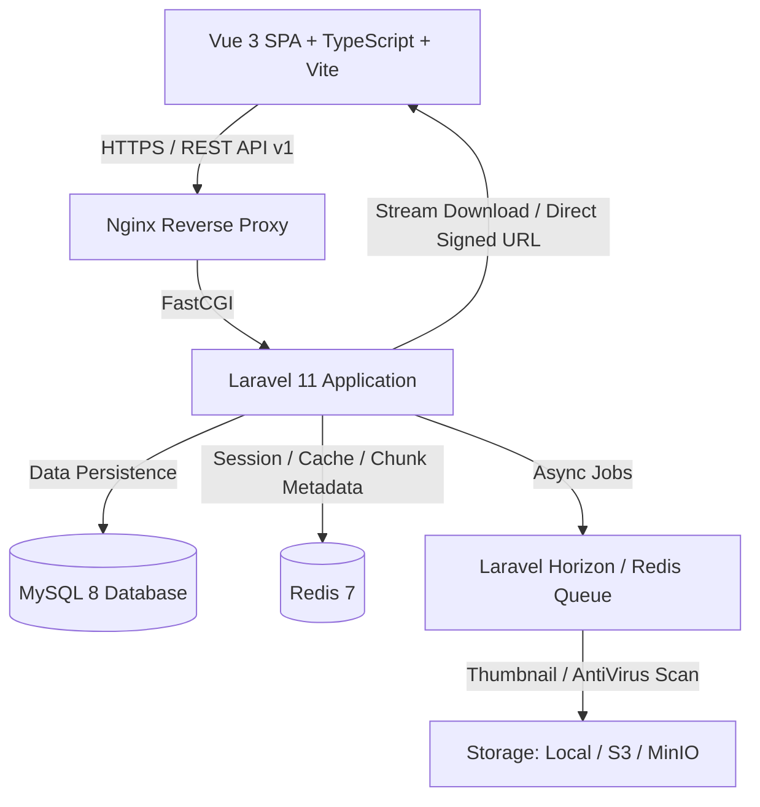
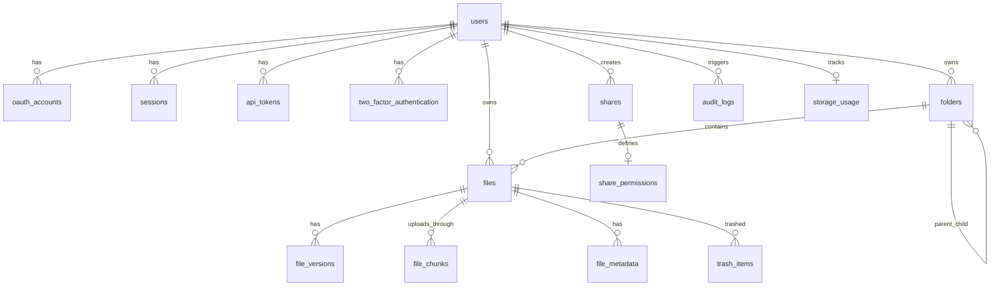

# MyStorage — Modern Self-Hosted Cloud Storage Platform

[](https://laravel.com)
[](https://vuejs.org)
[](https://www.typescriptlang.org)
[](https://tailwindcss.com)
[](https://www.mysql.com)
[](https://redis.io)

**MyStorage** adalah platform cloud storage mandiri modern berstandar enterprise dengan pengalaman pengguna seperti Google Drive dan Dropbox, tetapi dirancang dengan arsitektur independen yang berfokus pada performa tinggi, keamanan multi-lapis, dan skalabilitas penyimpanan objek.

---

## 🌟 Fitur Utama

- 🚀 **Resumable Chunk Upload Engine:** Mengunggah file besar (hingga 5GB+) dalam chunk 5MB secara streaming tanpa membebani RAM server PHP. Dilengkapi kalkulasi kecepatan (MB/s), estimasi waktu (ETA), pause, resume, dan validasi checksum SHA-256 otomatis.
- 🗄️ **Storage Abstraction Layer:** Kompatibel dengan Local Disk, AWS S3, MinIO, atau Cloud Object Storage tanpa mengubah logic bisnis.
- 🔒 **Keamanan & Isolasi Tingkat Tinggi:** 
  - Validasi byte signature / magic bytes anti-spoofing (tidak mempercayai header browser).
  - Path penyimpanan fisik terobfuskasi (`tenants/{user_uuid}/{yyyy}/{mm}/{file_uuid}.{ext}`).
  - Signed URLs untuk pengunduhan file aman berbatas waktu.
  - Autentikasi Dua Langkah (2FA/TOTP) dengan kode pemulihan cadangan.
  - Rate limiting berbasis Redis untuk mencegah brute-force & denial of service.
- 👥 **Kontrol Berbagi Granular (Sharing):**
  - Tautan publik aman (`/s/{token}`) dengan opsi proteksi kata sandi dan tanggal kedaluwarsa.
  - Berbagi ke pengguna tertentu dengan izin: *Viewer*, *Commenter*, atau *Editor*.
  - Opsi penonaktifan pengunduhan fisik (*view-only*).
  - Integrasi pencarian target penerima melalui nomor WhatsApp ter-normalisasi (E.164) dengan perlindungan privasi.
- 📊 **Manajemen Kuota & Statistik Agregat:**
  - Default kuota penyimpanan 10 GB per pengguna (dapat dikonfigurasi).
  - Visualisasi penggunaan multi-kategori (Gambar, Dokumen, Video, Audio, Arsip).
  - Ambang batas peringatan kuota (Warning 80%, Critical 90%, Blocked 100%).
- 🔍 **Pencarian Global & Autocomplete Cepat:** Pencarian berkas dan folder secara instan berdasarkan nama, ekstensi, dan kategori MIME.
- 🗑️ **Sistem Sampah (Trash) & Retensi 30 Hari:** Berkas yang dihapus dapat dipulihkan kapan saja sebelum batas retensi otomatis 30 hari berakhir.
- 🎨 **Antarmuka Pengguna Modern & Elegan:**
  - Vue 3 Composition API + TypeScript + Tailwind CSS.
  - Dukungan penuh Dark Mode & Light Mode.
  - Dukungan i18n dwibahasa (Bahasa Indonesia & English).
  - Drag-and-drop berkas langsung ke peramban.
  - Pratinjau berkas langsung (Gambar, Video, Audio, PDF).
- 🖥️ **Desktop Sync Client (Tauri + Rust + SQLite):**
  - Pemantau perubahan file sistem secara realtime (*native cross-platform OS watcher*).
  - Feed perubahan inkremental berbasis cursor server (`/api/v1/sync/changes`).
  - Resolusi konflik cerdas 3 strategi: *Keep Local*, *Keep Cloud*, *Keep Both*.
  - Sinkronisasi selektif folder (*Selective Sync*) untuk hemat ruang hardisk PC.
  - Manajemen daya baterai dan deteksi jaringan bertarif (*metered connection*).
  - Jaminan keamanan: Pencabutan akses perangkat server TIDAK PERNAH menghapus file lokal di komputer pengguna.
- 📝 **Online Office Suite Terintegrasi:**
  - Editor Dokumen Teks (`.docx`) dengan formatting ribbon (Bold, Italic, H1/H2/H3, Justify, Lists).
  - Editor Lembar Sebar / Spreadsheet (`.xlsx`) dengan formula bar interaktif (`=SUM()`, `=AVERAGE()`) dan grid dinamis.
  - Editor Presentasi Slide (`.pptx`) dengan slide thumbnails navigator, tema warna, catatan pembicara, dan mode slideshow layar penuh.
  - Sistem penguncian dokumen (*document locking*) dengan heartbeat lease untuk mencegah tabrakan edit konkuren.
  - Draft autosave berkala dan pembuatan versi berkas otomatis (*version control*).
  - Wizard template dokumen bawaan (Proposal Proyek, Anggaran Bulanan, Pitch Deck).
- ⚡ **Background Queue & Caching:** Thumbnail generator webp otomatis, sinkronisasi storage usage asinkron, dan caching Redis untuk respon responsif di bawah 50ms.
- 🔑 **Developer REST API v1:** API lengkap dengan otentikasi Sanctum dan manajemen Personal Access Token.

---

## 🏗️ Arsitektur Sistem



---

## 📋 Struktur Database (Entity Relationship)



Tabel utama yang tersedia:
1. `users`, `user_profiles`, `oauth_accounts`, `sessions`
2. `folders`, `files`, `file_versions`, `file_metadata`, `file_chunks`
3. `shares`, `share_permissions`, `favorites`, `trash_items`
4. `storage_disks`, `storage_usage`, `audit_logs`, `security_events`
5. `two_factor_authentication`, `recovery_codes`, `webhook_logs`, `notifications`

---

## 📁 Struktur Direktori Proyek

```text
mystorage/
├── app/
│   ├── Actions/
│   │   ├── Auth/           # RegisterAction, GoogleAuthAction
│   │   ├── Files/          # UploadFileAction, CompleteUploadAction, Delete, Restore, Move
│   │   ├── Folders/        # CreateFolderAction, MoveFolderAction, DeleteFolderAction
│   │   ├── Shares/         # ShareFileAction, RevokeShareAction
│   │   └── Storage/        # CalculateStorageUsageAction, GenerateDownloadUrlAction
│   ├── Enums/              # UserRole, UserStatus, FileStatus, FileVisibility, etc.
│   ├── Http/
│   │   ├── Controllers/Api/V1/ # Auth, Files, Folders, UploadChunk, Share, Storage, Security
│   │   └── Middleware/     # SecurityHeaders, EnsureAccountActive, EnsureEmailVerified
│   ├── Jobs/               # GenerateThumbnailJob, SendWhatsAppNotificationJob
│   ├── Models/             # Eloquent Models (User, FileItem, Folder, Share, AuditLog, etc.)
│   └── Services/
│       ├── Storage/        # StorageService, StorageDriverInterface
│       ├── Security/       # FileSecurityValidator
│       └── Notifications/  # WhatsAppNotificationService, GenericWhatsAppProvider
├── docker/                 # Nginx & Supervisor configuration
├── resources/
│   ├── js/
│   │   ├── components/     # FileCard, FileTable, FolderCard, UploadManagerModal, ShareModal, etc.
│   │   ├── composables/    # useI18n, useUploadManager
│   │   ├── layouts/        # AppLayout.vue
│   │   ├── pages/          # DrivePage, Recent, Starred, Shared, Trash, Storage, Security, Settings, Auth
│   │   ├── stores/         # Pinia stores (auth, drive, upload, ui)
│   │   └── types/          # TypeScript interface definitions
│   └── views/              # app.blade.php (SPA host)
├── routes/                 # api.php (v1 routes), web.php
└── tests/                  # Feature & Unit test suites
```

---

## ⚙️ Persyaratan Sistem

- PHP 8.2 atau 8.3+ (ekstensi: `pdo`, `mbstring`, `openssl`, `fileinfo`, `curl`, `zip`, `bcmath`, `gd`)
- Composer 2.x
- Node.js 18+ / 22+ & npm
- MySQL 8.0+ atau PostgreSQL / SQLite
- Redis 6.2+
- Nginx / Apache

---

## 🚀 Panduan Instalasi Cepat

### Opsi A: Menjalankan Secara Lokal

1. **Clone repository:**
   ```bash
   git clone https://github.com/Igustisultanh12/PENYIMPANAN.git
   cd PENYIMPANAN
   ```

2. **Install dependensi Backend & Frontend:**
   ```bash
   composer install
   npm install
   ```

3. **Konfigurasi Environment:**
   ```bash
   cp .env.example .env
   php artisan key:generate
   ```

4. **Jalankan Migrasi Database:**
   ```bash
   php artisan migrate
   ```

5. **Build Aset Frontend:**
   ```bash
   npm run build
   # atau untuk mode development:
   npm run dev
   ```

6. **Jalankan Server & Queue Worker:**
   ```bash
   # Terminal 1: Web Server
   php artisan serve

   # Terminal 2: Queue Worker
   php artisan queue:work
   ```
   Buka peramban di `http://localhost:8000`.

---

### Opsi B: Menjalankan dengan Docker Compose

Untuk deployment produksi yang terisolasi lengkap dengan MySQL, Redis, dan MinIO:

```bash
docker-compose up -d --build
docker-compose exec app php artisan migrate --force
```

Aplikasi siap diakses di `http://localhost` (Nginx), MinIO Console di `http://localhost:9001`.

---

## 🧪 Menjalankan Automated Tests

Test suite mencakup uji isolasi antar pengguna, pembatasan kuota penyimpanan, validasi chunk upload, pembatasan berkas terlarang, dan kedaluwarsa tautan:

```bash
php artisan test
```

Hasil uji coba:
```text
   PASS  Tests\Unit\ExampleTest
   PASS  Tests\Feature\AuthenticationTest
   PASS  Tests\Feature\AuthorizationAndSecurityTest
   PASS  Tests\Feature\ChunkUploadTest
   PASS  Tests\Feature\ExampleTest

   Tests:    8 passed (25 assertions)
   Duration: 0.83s
```

---

## 📖 Dokumentasi REST API

Spesifikasi OpenAPI 3.0 lengkap tersedia di `docs/openapi.yaml`.

Contoh Endpoint Utama:
| Metode | Endpoint | Deskripsi | Autentikasi |
|---|---|---|---|
| `POST` | `/api/v1/auth/register` | Mendaftarkan akun baru | Publik |
| `POST` | `/api/v1/auth/login` | Login & mendapatkan Sanctum token | Publik |
| `GET` | `/api/v1/me` | Informasi profil & kuota pengguna | Bearer Token |
| `GET` | `/api/v1/files` | Daftar berkas (filter: folder, kategori, bintang) | Bearer Token |
| `POST` | `/api/v1/uploads/initiate` | Inisialisasi sesi resumable chunk upload | Bearer Token |
| `POST` | `/api/v1/uploads/{id}/chunk` | Mengirimkan potongan binary chunk (5MB) | Bearer Token |
| `GET` | `/api/v1/uploads/{id}/status` | Cek chunk yang sudah terunggah (resume) | Bearer Token |
| `POST` | `/api/v1/uploads/{id}/finalize` | Menggabungkan seluruh chunk & validasi | Bearer Token |
| `POST` | `/api/v1/shares` | Membuat tautan berbagi (password, expiry) | Bearer Token |
| `GET` | `/api/v1/shares/public/{token}` | Mengakses berkas dari tautan publik | Publik |
| `GET` | `/api/v1/storage/stats` | Statistik penggunaan penyimpanan agregat | Bearer Token |
| `GET` | `/api/v1/search` | Pencarian global berkas dan folder | Bearer Token |
| `POST` | `/api/v1/search/whatsapp-lookup` | Pencarian pengguna via WhatsApp aman | Bearer Token |
| `POST` | `/api/v1/security/2fa/setup` | Inisialisasi 2FA / TOTP Authenticator | Bearer Token |

---

## 🛡️ Kebijakan Keamanan & Backup

1. **Enkripsi & Proteksi Token:** Seluruh token verifikasi, token API, dan kata sandi di-hash menggunakan `SHA-256` dan `bcrypt`. Secret 2FA dienkripsi secara simetris di level aplikasi.
2. **Streaming Memory-Safe:** Penggabungan chunk upload dan streaming pengunduhan menggunakan buffer 8MB-10MB, menjamin konsumsi memori server tetap rendah terlepas dari ukuran berkas.
3. **Strategi Backup:**
   - Database: Jalankan dump rutin `mysqldump -u [user] -p mystorage > backup.sql`.
   - Object Storage: Sinkronisasi bucket berkala menggunakan alat sinkronisasi objek (`aws s3 sync` atau `mc mirror`).
   - Backup Key: Amankan file `.env` dan `APP_KEY` di brankas terpisah (KMS).

---

## 📄 Lisensi

Platform MyStorage dilisensikan di bawah [MIT License](LICENSE).
